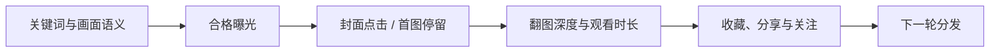

# 双平台壁纸账号运营 Skill

面向小红书与抖音壁纸账号的 Codex 技能：从竞品研究、人文摄影视觉方向、高清壁纸制作，到搜索文案、发布前准备和数据复盘，形成一套可以持续迭代的内容工作流。

[](./SKILL.md)
[](./references/account-playbook.md)
[](./scripts/verify_wallpaper_assets.py)

## 解决什么问题

壁纸账号的流量不只取决于“图片好不好看”。完整链路是：



这个 Skill 将创作和数据放在同一个闭环里：

- 研究参考账号，但只迁移原则，不复制图片、签名或构图。
- 建立人文摄影、蓝调时刻、城市叙事等连续视觉系列。
- 生成适配现代手机的高清壁纸母版和平台副本。
- 分离“吸引点击的封面”与“可以直接使用的无字壁纸”。
- 为小红书搜索和抖音首屏分别设计标题、话题与图片顺序。
- 读取创作者中心数据，判断是曝光不足、点击不足，还是收藏价值不足。
- 完成上传和文案填写后停在最终发布按钮前，由用户确认发布。

## 默认交付规格

| 用途 | 比例 | 首选尺寸 | 说明 |
|---|---:|---:|---|
| 高清壁纸母版 | 9:20 | 2160×4800 或更高 | 保留无字、无水印版本 |
| 小红书封面母版 | 3:4 | 2160×2880 | 针对搜索页和主页缩略图构图 |
| 小红书封面副本 | 3:4 | 1080×1440 | 平台或工作流需要时导出 |
| 壁纸分发副本 | 9:20 | 1080×2400 或更高 | 由高清母版生成 |
| 抖音图文副本 | 1:2 | 2160×4320 | 上传器不接受时使用 1080×2160 |

尺寸变大不等于细节变多。Skill 会区分原生高分辨率、AI 超分辨率和普通插值放大，不把简单拉伸后的文件标成“原生 4K”。

## 使用方式

将仓库安装到 Codex 技能目录：

```text
请使用 skill-installer 从 GitHub 仓库
Dsqs1029/operate-xiaohongshu-wallpaper-account
安装 operate-xiaohongshu-wallpaper-account。
```

安装完成后，可以这样调用：

```text
使用 $operate-xiaohongshu-wallpaper-account
为小红书制作下一期 9:20 人文摄影壁纸，生成高清母版，
准备好标题、正文和话题，并停在最终发布前。
```

```text
使用 $operate-xiaohongshu-wallpaper-account
把刚才的小红书主题适配成抖音图文，控制为 4 张，
检查 1:2 比例并分析上一期的划走率。
```

```text
使用 $operate-xiaohongshu-wallpaper-account
读取两个平台的最新数据，判断流量停在哪一层，
并给出下一期只改变一个变量的实验方案。
```

## 图片质量校验

仓库提供了确定性的尺寸与比例检查脚本：

```bash
python scripts/verify_wallpaper_assets.py \
  --profile wallpaper-master \
  path/to/wallpaper.png
```

支持的 profile：

- `wallpaper-master`：至少 2160×4800，严格 9:20。
- `xhs-cover-master`：至少 2160×2880，严格 3:4。
- `wallpaper-distribution`：至少 1080×2400，严格 9:20。
- `douyin-upload`：至少 1080×2160，严格 1:2。

脚本需要 Pillow：

```bash
python -m pip install Pillow
```

## 数据诊断框架

### 小红书

重点观察：

- 曝光
- 封面点击率
- 观看与平均观看时长
- 收藏、分享和涨粉
- 搜索词及流量来源

本账号当前将封面点击率 `≥12%` 作为实验目标。这个数值来自历史内容对比，只是工作阈值，不是平台保证。

### 抖音

图文后台不一定提供封面点击率，因此使用：

- `100% - 划走率` 作为首图停留率
- 平均浏览图片数 ÷ 总图片数作为翻图深度
- 收藏、分享和关注作为后续价值信号

当前实验目标：

- 划走率 `≤40%`
- 平均翻图深度 `≥65%`
- 优先测试 3–4 张图片，而不是机械照搬小红书的 6 张

## 视觉方向

核心方向是具有真实生活痕迹的电影感人文壁纸：

- 蓝调、黎明、雨雪、雾、海岸天气
- 车站、渡轮、旧巴士、便利店、道路、桥梁和窗户
- 小比例人物或人类痕迹，而不是普通大头人像
- 大面积环境留白和一个克制的暖色锚点
- 自然颗粒、轻微运动模糊、旧材质和可信的阴影

避免廉价霓虹、塑料质感、虚假奢华、无法辨认的 AI 文字，以及缺少叙事主体的空泛风景。

## 安全边界

- 不伪造摄影器材、拍摄地点或纪实经历。
- AI 辅助视觉内容需要在正文和平台声明中如实标注。
- 不复制参考创作者的原图、签名、标题公式或标志性构图。
- 不承诺流量，也不根据单篇作品武断判断“限流”。
- 不替用户点击小红书、抖音或其他平台的最终发布按钮。

## 仓库结构

```text
.
├── SKILL.md
├── agents/
│   └── openai.yaml
├── references/
│   └── account-playbook.md
└── scripts/
    └── verify_wallpaper_assets.py
```

详细执行规则见 [SKILL.md](./SKILL.md)，账号历史基线与跨平台诊断案例见 [account-playbook.md](./references/account-playbook.md)。
